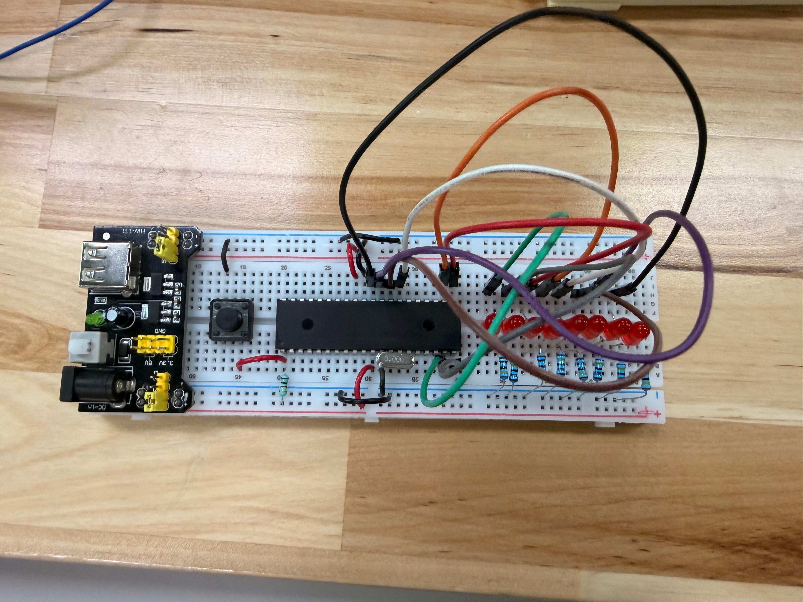
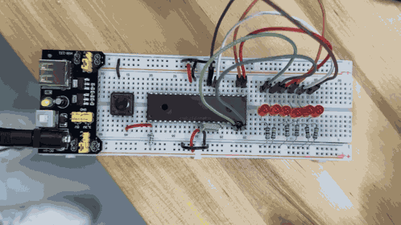

# Actividad 1 — Contador binario de 6 bits

## Descripción

En esta práctica se implementó un contador binario de 6 bits utilizando el microcontrolador **PIC16F887**. El objetivo fue representar un conteo del 0 al 63 mediante LEDs conectados a salidas digitales del microcontrolador.

Cada LED representa un bit del número binario mostrado en el puerto de salida. De esta forma, al avanzar el contador, los LEDs cambian de estado dependiendo del valor binario correspondiente.

Esta actividad permitió reforzar el uso de salidas digitales, el manejo del registro `PORTD`, la configuración del puerto mediante `TRISD` y la representación de números binarios en un circuito físico o simulado.

---

## Componentes utilizados

- PIC16F887
- 6 LEDs
- 6 resistencias
- Cristal oscilador
- Botón de reset
- Resistencia para MCLR
- Fuente Vcc
- Tierra GND
- MPLAB X IDE
- Compilador XC8
- Proteus Design Suite

---

## Evidencias

### Simulación en Proteus


### Video de funcionamiento

[](./video_funcionamiento.mp4)

---

## Evidencias físicas

Además de la simulación en Proteus, la práctica fue implementada físicamente utilizando el microcontrolador **PIC16F887** montado en protoboard. En el circuito se conectaron 6 LEDs a las salidas digitales del microcontrolador mediante resistencias, de manera que cada LED representa un bit del contador binario.

El funcionamiento físico permite observar cómo el contador avanza desde `000000` hasta `111111`, representando los valores decimales del 0 al 63 mediante el encendido y apagado de los LEDs.

### Armado general del circuito


### Conexiones del PIC16F887




### Video del funcionamiento físico

[](./evidencias_fisicas/video_fisico_contador.mp4)


### Carpeta completa de evidencias físicas

[Ver evidencias físicas](./evidencias_fisicas)

## Funcionamiento del circuito

En la simulación se utilizó el microcontrolador **PIC16F887** conectado a 6 LEDs mediante resistencias. Los LEDs representan los 6 bits menos significativos del puerto D, por lo que cada combinación de encendido y apagado muestra un número binario distinto.

El conteo inicia en `000000`, que equivale al número decimal 0, y avanza hasta `111111`, que equivale al número decimal 63. Después de llegar a 63, el contador vuelve a 0 y repite el ciclo continuamente.

---

## Lógica de programación

Primero se declara una variable llamada `contador`, la cual almacena el valor actual del conteo:

```c
unsigned char contador = 0;
```

Después se configura el puerto D como salida:

```c
TRISD = 0b00000000;
```

Dentro del ciclo infinito, el valor del contador se manda al puerto D, pero se aplica una máscara para usar únicamente los primeros 6 bits:

```c
PORTD = contador & 0b00111111;
```

La máscara `0b00111111` permite que solo se usen los bits del 0 al 5. Esto evita que los bits 6 y 7 del puerto D afecten el funcionamiento de la práctica.

Después, el contador aumenta en una unidad:

```c
contador++;
```

Cuando el contador supera el valor 63, se reinicia a 0:

```c
if(contador > 63){
    contador = 0;
}
```

Finalmente, se utiliza un retardo de 500 ms para que el cambio entre números pueda observarse claramente en los LEDs.

---

## Código utilizado

```c
#include <xc.h>

//=============================================================================
// CONFIGURACIÓN DE BITS DE CONFIGURACIÓN
//=============================================================================

#pragma config FOSC = XT        // Selección de oscilador XT
#pragma config WDTE = OFF       // Watchdog Timer desactivado
#pragma config PWRTE = OFF      // Power-up Timer desactivado
#pragma config BOREN = ON       // Brown-out Reset activado
#pragma config LVP = OFF        // Programación en bajo voltaje desactivada
#pragma config CPD = OFF        // Protección EEPROM desactivada
#pragma config WRT = OFF        // Escritura en memoria Flash desactivada
#pragma config CP = OFF         // Protección de código desactivada

//=============================================================================
// DEFINICIONES
//=============================================================================

#define _XTAL_FREQ 8000000      // Frecuencia del oscilador

void main(void){
    unsigned char contador = 0; // Variable para almacenar el conteo

    TRISD = 0b00000000;         // Configura PORTD como salida
    PORTD = 0b00000000;         // Inicializa PORTD apagado

    while(1){
        PORTD = contador & 0b00111111; // Muestra solo los primeros 6 bits

        contador++;                    // Incrementa el contador

        if(contador > 63){             // Si supera 63, reinicia
            contador = 0;
        }

        __delay_ms(500);               // Retardo de 500 ms
    }
}
```

---

## Tabla de referencia

| Decimal | Binario de 6 bits | Estado de LEDs |
|---|---|---|
| 0 | 000000 | Todos apagados |
| 1 | 000001 | LED 1 encendido |
| 2 | 000010 | LED 2 encendido |
| 3 | 000011 | LED 1 y LED 2 encendidos |
| 4 | 000100 | LED 3 encendido |
| 8 | 001000 | LED 4 encendido |
| 16 | 010000 | LED 5 encendido |
| 32 | 100000 | LED 6 encendido |
| 63 | 111111 | Todos encendidos |

---

## Resultado esperado

Al ejecutar la simulación, los LEDs deben mostrar un conteo binario desde `000000` hasta `111111`. Cada cambio representa un incremento en el contador, avanzando desde el número decimal 0 hasta el 63.

Después de llegar a 63, el conteo se reinicia automáticamente y vuelve a comenzar desde 0.

---

## Conclusión

Esta práctica permitió comprender cómo representar un contador binario utilizando salidas digitales del PIC16F887. Mediante el uso del registro `PORTD`, una variable de conteo y una máscara binaria, se logró controlar el estado de 6 LEDs de forma ordenada. Además, la simulación en Proteus ayudó a visualizar la relación entre los valores binarios del programa y el comportamiento físico de los LEDs.
