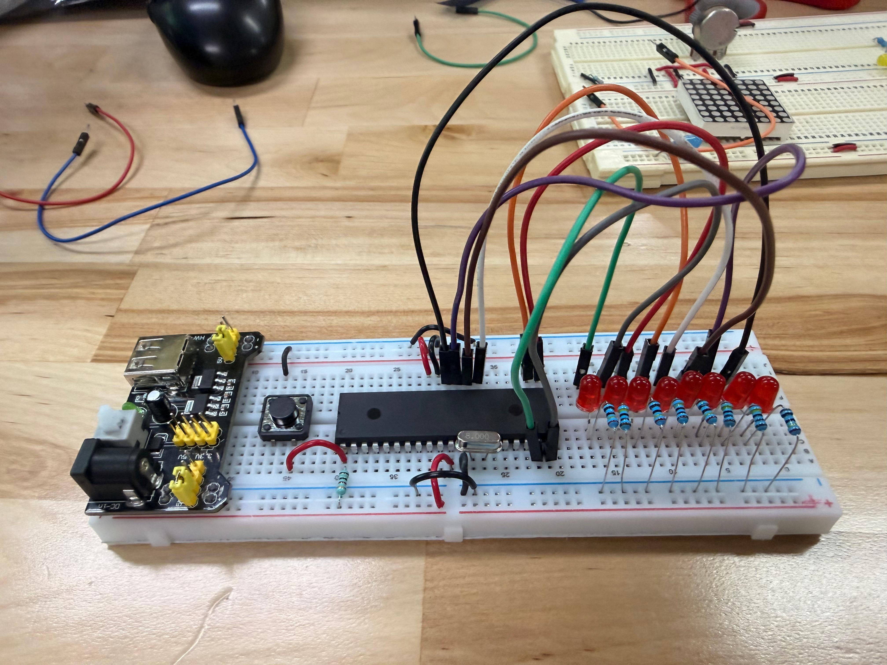
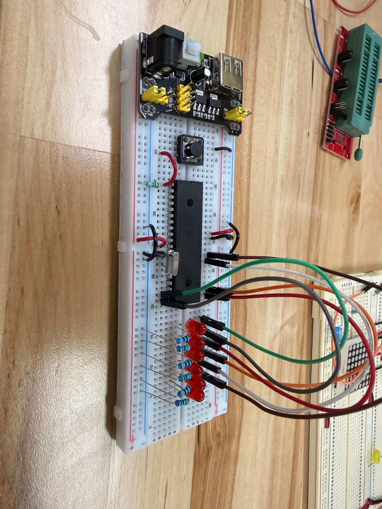

# Actividad 2 — Secuencia tipo caminata de 8 bits

## Descripción

En esta práctica se realiza una secuencia tipo caminata utilizando 8 LEDs conectados a salidas digitales del microcontrolador **PIC16F887**. El objetivo principal es encender un LED a la vez y desplazar ese encendido de forma ordenada a través de los 8 bits del puerto utilizado.

Esta actividad permite comprender el manejo de puertos digitales completos, el uso de valores binarios para controlar salidas y la generación de secuencias visuales mediante programación en lenguaje C.

---

## Componentes utilizados

- PIC16F887
- 8 LEDs
- 8 resistencias
- Cristal oscilador
- Botón de reset
- Resistencia para MCLR
- Fuente Vcc
- Tierra GND
- MPLAB X IDE
- Compilador XC8
- Proteus Design Suite

---

## Evidencias

### Simulación en Proteus


### Video de funcionamiento

[](./video_funcionamiento.mp4)

---

## Evidencias físicas

---

## Evidencias físicas

La práctica también fue implementada físicamente en protoboard utilizando el microcontrolador **PIC16F887**. En el circuito se conectaron los LEDs a las salidas digitales del microcontrolador mediante resistencias, permitiendo observar el efecto de caminata directamente en el hardware.

### Armado general



### Conexiones del microcontrolador




### Video de funcionamiento físico

[](./evidencias_fisicas/video_fisico_funcionamiento.mp4)

### Evidencias completas

[Ver carpeta de evidencias físicas](./evidencias_fisicas)


## Funcionamiento del circuito

En la simulación se utiliza el microcontrolador **PIC16F887** conectado a 8 LEDs mediante resistencias. Cada LED representa un bit del puerto de salida utilizado, por lo que el microcontrolador puede encender o apagar cada LED escribiendo diferentes valores binarios en el puerto.

La secuencia tipo caminata consiste en encender únicamente un LED a la vez. Después de un pequeño retardo, el encendido se desplaza al siguiente LED, generando un efecto visual de movimiento. Cuando la secuencia llega al último LED, puede reiniciarse desde el primero o regresar en sentido contrario, dependiendo de la lógica programada.

---

## Lógica de programación

La idea principal de esta práctica es utilizar valores binarios donde solamente un bit esté encendido a la vez. Por ejemplo:

| Paso | Valor binario | LED encendido |
|---|---|---|
| 1 | `00000001` | LED 1 |
| 2 | `00000010` | LED 2 |
| 3 | `00000100` | LED 3 |
| 4 | `00001000` | LED 4 |
| 5 | `00010000` | LED 5 |
| 6 | `00100000` | LED 6 |
| 7 | `01000000` | LED 7 |
| 8 | `10000000` | LED 8 |

Para lograr este comportamiento, se puede utilizar una variable que se vaya desplazando bit por bit. Cada desplazamiento cambia el LED encendido, mientras los demás permanecen apagados.

El puerto se configura como salida mediante el registro `TRISD`:

```c
TRISD = 0b00000000;
```

Después, se escribe en el puerto el valor correspondiente al LED que se desea encender:

```c
PORTD = valor;
```

Finalmente, se utiliza un retardo para que el cambio entre LEDs pueda observarse claramente en la simulación.

---

## Código utilizado

> Código pendiente por agregar.

```c
/*
Código de la secuencia tipo caminata de 8 bits.
Pendiente por agregar.
*/
```

---

## Resultado esperado

Al ejecutar la simulación, se debe observar que los LEDs se encienden uno por uno de forma secuencial. El encendido inicia en el primer LED y avanza hasta llegar al octavo LED. Después, la secuencia se repite continuamente.

Este comportamiento genera el efecto visual de una caminata de bits, donde el estado lógico alto se desplaza a través del puerto del microcontrolador.

---

## Conclusión

Esta práctica permitió reforzar el manejo de salidas digitales del PIC16F887 mediante una secuencia ordenada de LEDs. A diferencia de las actividades anteriores, aquí no se encendieron varios LEDs al mismo tiempo ni se representó un conteo binario, sino que se trabajó el desplazamiento de un solo bit activo. Esto ayuda a comprender cómo los valores binarios pueden utilizarse para generar patrones visuales y controlar varias salidas de manera secuencial.
