# Actividad 1 — Display de 7 segmentos: contador hexadecimal

## Descripción

En esta actividad se realizó un contador hexadecimal del **0 al F** utilizando un **display de 7 segmentos** y el microcontrolador **PIC16F887**. El objetivo principal fue representar los valores hexadecimales `0, 1, 2, 3, 4, 5, 6, 7, 8, 9, A, b, C, d, E, F` mediante patrones enviados al puerto D.

A diferencia del contador decimal, esta actividad requiere representar seis caracteres adicionales después del número 9. Para ello, se utilizó un arreglo llamado `hex`, el cual contiene 16 valores correspondientes a cada símbolo hexadecimal.

Esta práctica permitió reforzar el uso de arreglos, valores hexadecimales, salidas digitales y control de displays de 7 segmentos mediante el PIC16F887.

---

## Componentes utilizados

* PIC16F887
* Display de 7 segmentos
* 7 resistencias de 240 Ω
* Cristal oscilador
* Botón de reset
* Resistencia para MCLR
* Fuente Vcc
* Tierra GND
* MPLAB X IDE
* Compilador XC8
* Proteus Design Suite

---

### Simulación en Proteus

A continuación se muestran los valores hexadecimales visualizados en el display de 7 segmentos durante la simulación en Proteus.

<table>
  <tr>
    <td align="center"><strong>0</strong></td>
    <td align="center"><strong>1</strong></td>
    <td align="center"><strong>2</strong></td>
    <td align="center"><strong>3</strong></td>
  </tr>
  <tr>
    <td>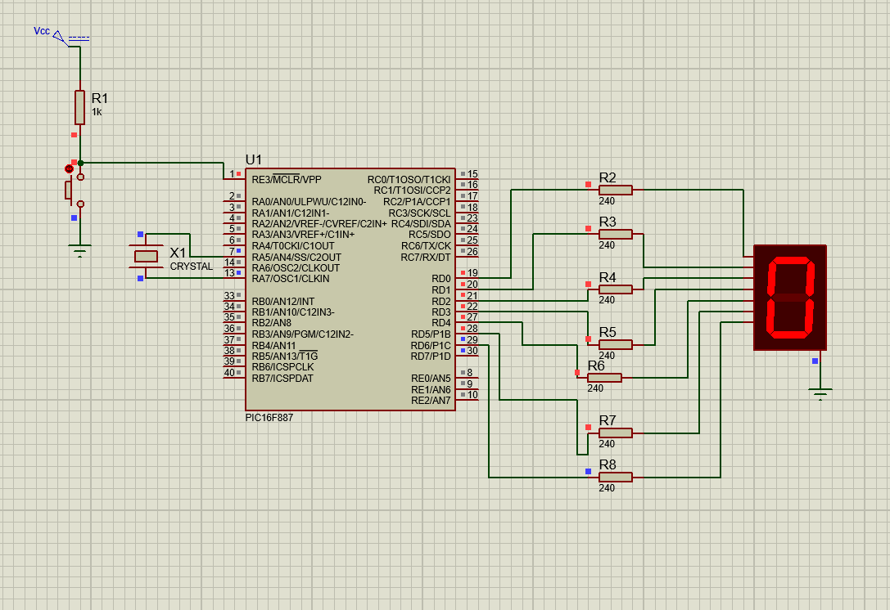</td>
    <td>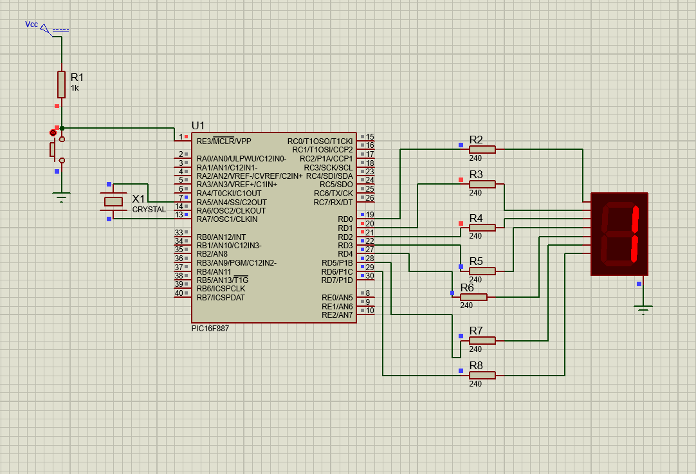</td>
    <td>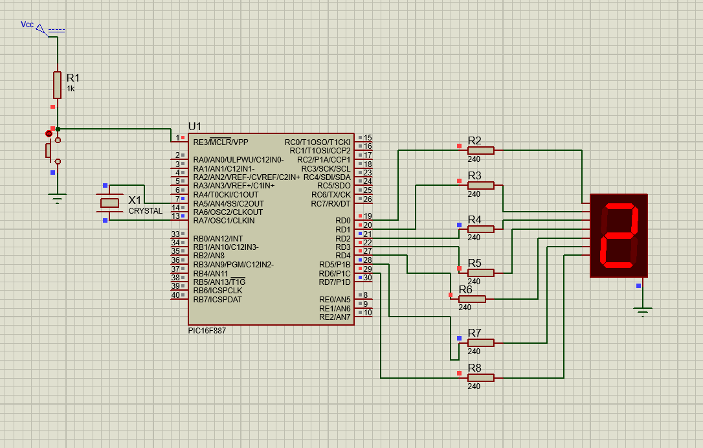</td>
    <td>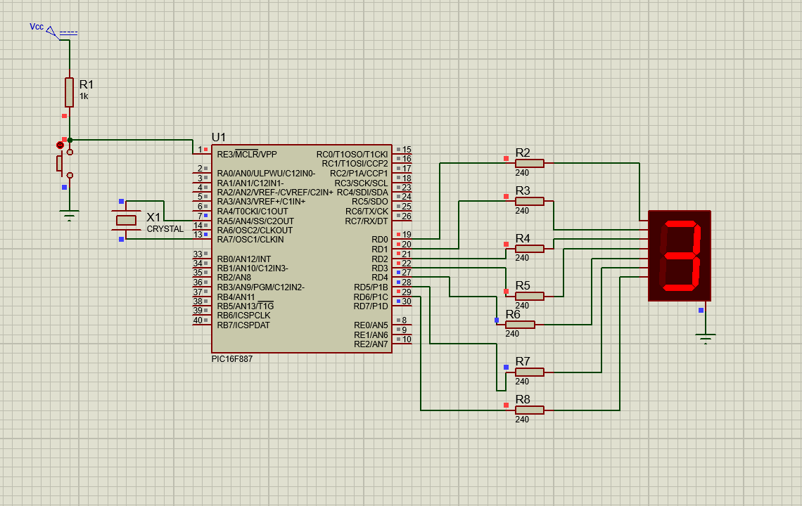</td>
  </tr>
  <tr>
    <td align="center"><strong>4</strong></td>
    <td align="center"><strong>5</strong></td>
    <td align="center"><strong>6</strong></td>
    <td align="center"><strong>7</strong></td>
  </tr>
  <tr>
    <td>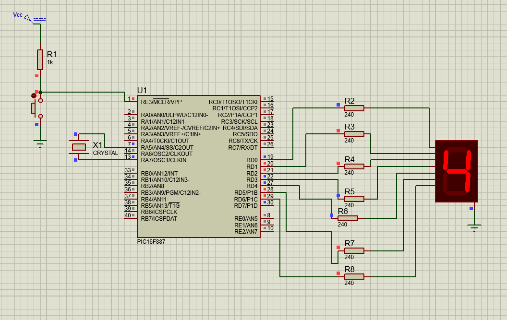</td>
    <td>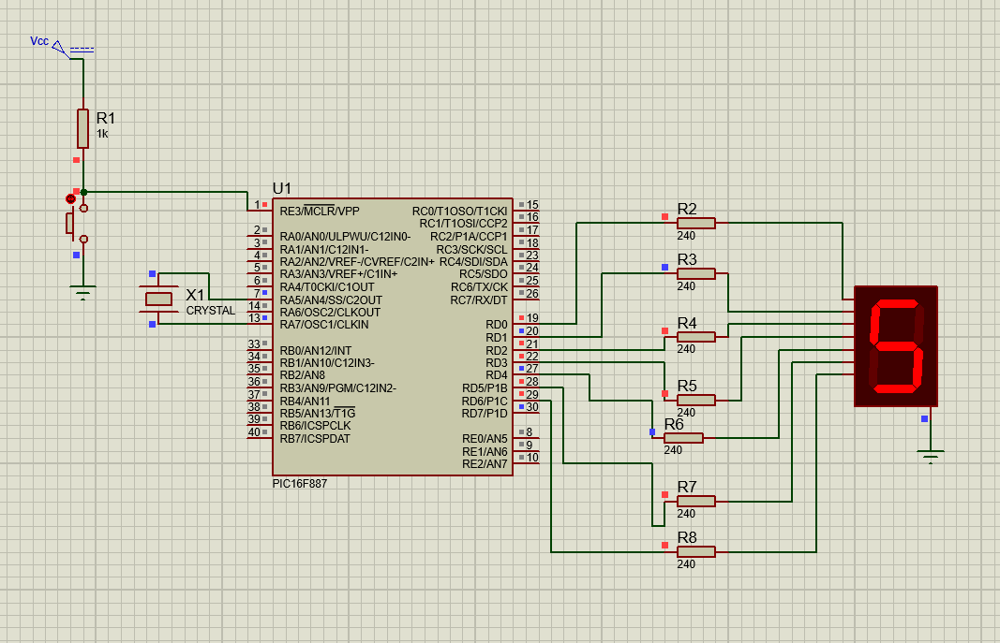</td>
    <td>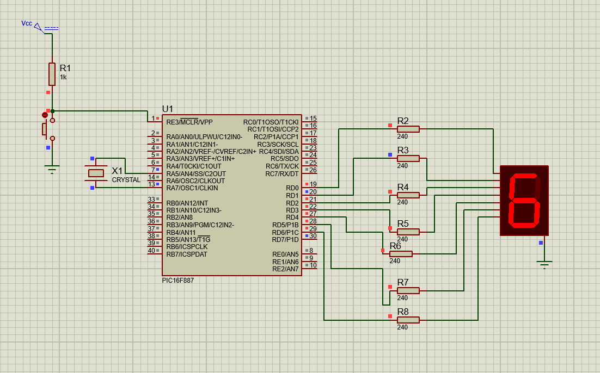</td>
    <td>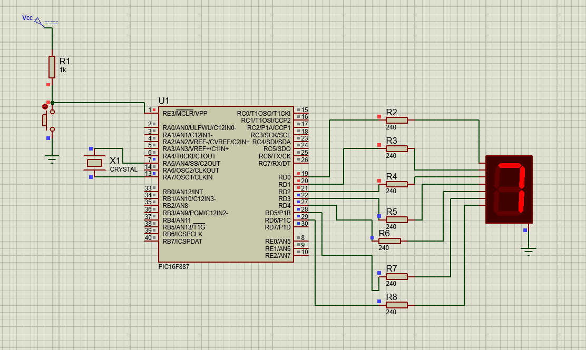</td>
  </tr>
  <tr>
    <td align="center"><strong>8</strong></td>
    <td align="center"><strong>9</strong></td>
    <td align="center"><strong>A</strong></td>
    <td align="center"><strong>b</strong></td>
  </tr>
  <tr>
    <td>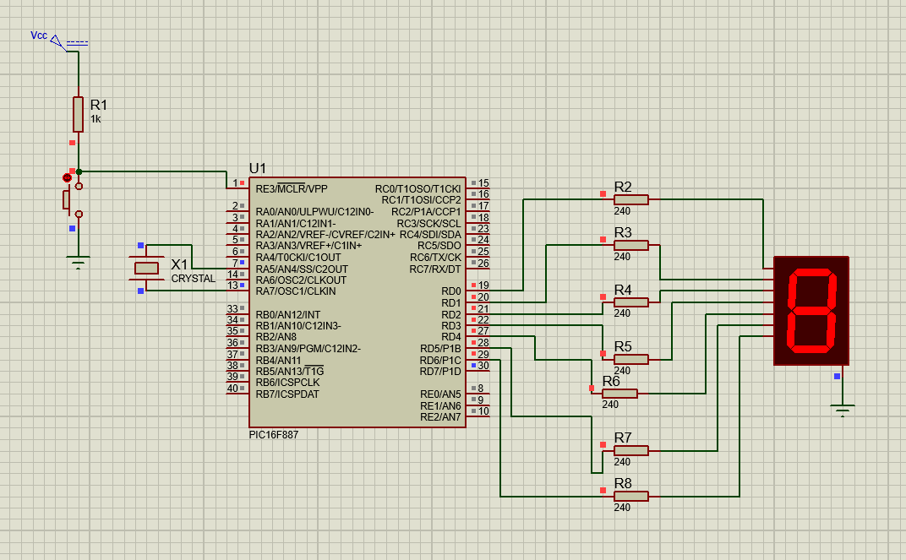</td>
    <td>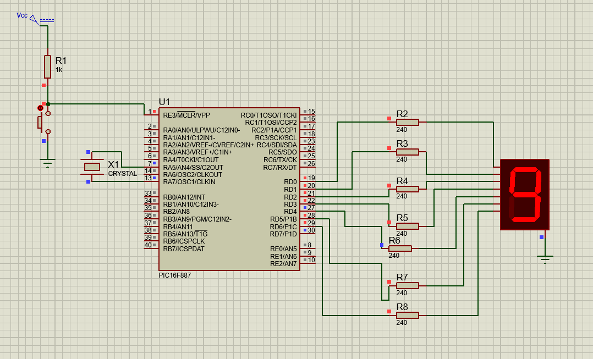</td>
    <td>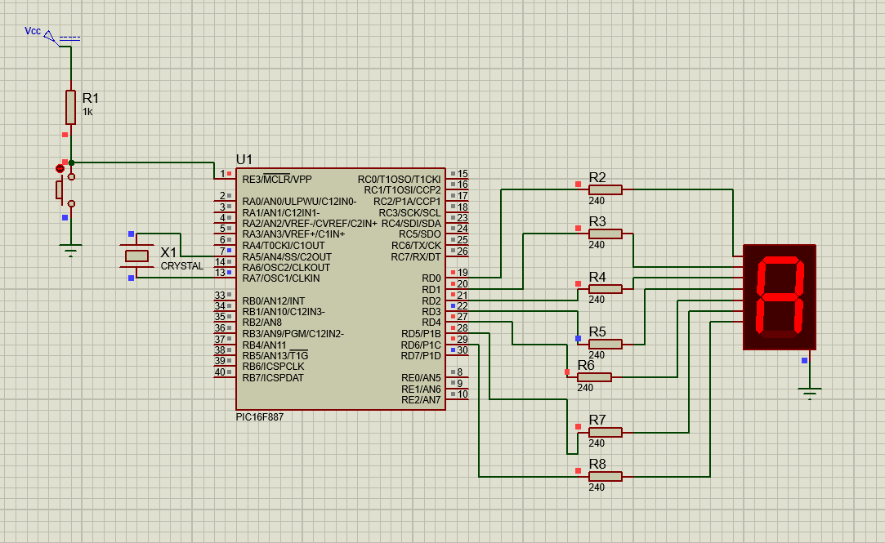</td>
    <td>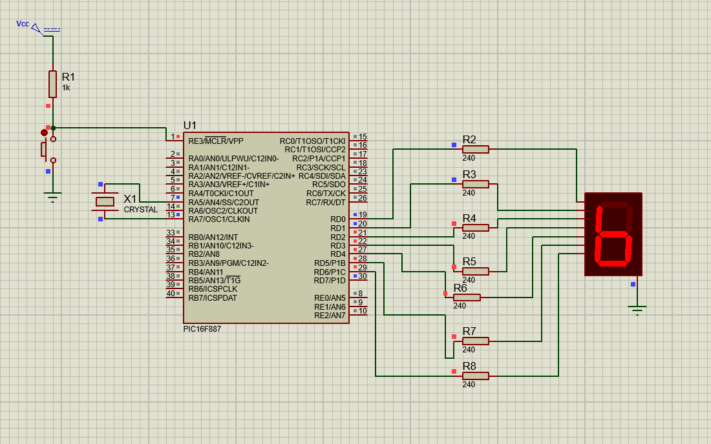</td>
  </tr>
  <tr>
    <td align="center"><strong>C</strong></td>
    <td align="center"><strong>d</strong></td>
    <td align="center"><strong>E</strong></td>
    <td align="center"><strong>F</strong></td>
  </tr>
  <tr>
    <td></td>
    <td></td>
    <td>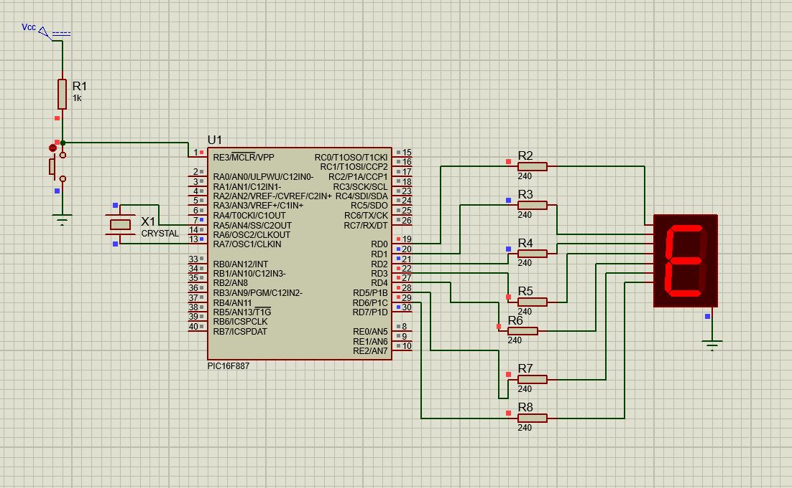</td>
    <td>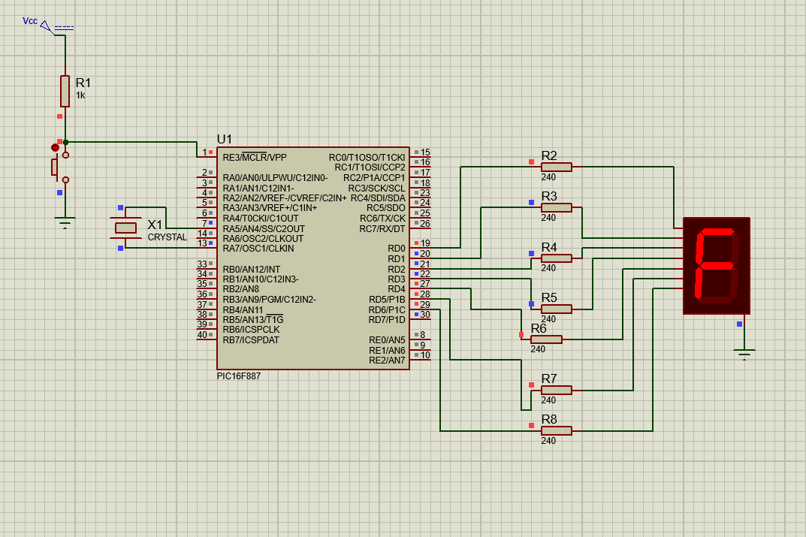</td>
  </tr>
</table>

### Video de funcionamiento en simulación

El siguiente enlace abre el video completo del contador hexadecimal funcionando en Proteus.

[Video de funcionamiento](./video_funcionamiento_16.mp4)

---

## Funcionamiento del circuito

En la simulación se conectó un display de 7 segmentos al puerto D del microcontrolador **PIC16F887**. Cada salida del puerto D controla un segmento del display mediante una resistencia de 240 Ω.

El contador inicia en `0` y avanza hasta `F`. Para representar los caracteres hexadecimales, se utilizan patrones específicos para cada símbolo. En el caso de las letras, se usan representaciones compatibles con un display de 7 segmentos, por ejemplo `b` y `d` se muestran en minúscula para evitar confusión con los números 8 y 0.

---

## Lógica de programación

Primero se define el arreglo `hex`, el cual contiene los 16 patrones necesarios para mostrar los valores hexadecimales:

```c
const unsigned char hex[16] = {
    0x3F, // 0
    0x06, // 1
    0x5B, // 2
    0x4F, // 3
    0x66, // 4
    0x6D, // 5
    0x7D, // 6
    0x07, // 7
    0x7F, // 8
    0x6F, // 9
    0x77, // A
    0x7C, // b
    0x39, // C
    0x5E, // d
    0x79, // E
    0x71  // F
};
```

Después se deshabilitan las entradas analógicas del microcontrolador:

```c
ANSEL = 0x00;
ANSELH = 0x00;
```

Luego se configura el puerto D como salida y se inicializa apagado:

```c
TRISD = 0x00;
PORTD = 0x00;
```

Dentro del ciclo infinito, se recorre el arreglo desde la posición 0 hasta la 15:

```c
for(unsigned char i = 0; i < 16; i++) {
    PORTD = hex[i];
    __delay_ms(500);
}
```

Cada valor del arreglo se envía al puerto D y permanece visible durante 500 ms antes de cambiar al siguiente.

---

## Tabla de referencia

| Valor | Patrón hexadecimal |
| ----- | ------------------ |
| 0     | `0x3F`             |
| 1     | `0x06`             |
| 2     | `0x5B`             |
| 3     | `0x4F`             |
| 4     | `0x66`             |
| 5     | `0x6D`             |
| 6     | `0x7D`             |
| 7     | `0x07`             |
| 8     | `0x7F`             |
| 9     | `0x6F`             |
| A     | `0x77`             |
| b     | `0x7C`             |
| C     | `0x39`             |
| d     | `0x5E`             |
| E     | `0x79`             |
| F     | `0x71`             |

---

## Código utilizado

```c
#include <xc.h>

#pragma config FOSC = HS
#pragma config WDTE = OFF
#pragma config PWRTE = OFF
#pragma config BOREN = ON
#pragma config LVP = OFF
#pragma config CPD = OFF
#pragma config WRT = OFF
#pragma config CP = OFF

#define _XTAL_FREQ 8000000

const unsigned char hex[16] = {
    0x3F, // 0
    0x06, // 1
    0x5B, // 2
    0x4F, // 3
    0x66, // 4
    0x6D, // 5
    0x7D, // 6
    0x07, // 7
    0x7F, // 8
    0x6F, // 9
    0x77, // A
    0x7C, // b
    0x39, // C
    0x5E, // d
    0x79, // E
    0x71  // F
};

void main(void) {

    ANSEL = 0x00;
    ANSELH = 0x00;
    TRISD = 0x00;
    PORTD = 0x00;

    while(1) {
        for(unsigned char i = 0; i < 16; i++) {
            PORTD = hex[i];
            __delay_ms(500);
        }
    }
}
```

---

## Resultado esperado

Al ejecutar la simulación, el display de 7 segmentos debe mostrar una secuencia hexadecimal desde `0` hasta `F`. Cada símbolo permanece visible durante 500 ms antes de avanzar al siguiente. Al llegar a `F`, el ciclo vuelve a comenzar desde `0`.

---

## Conclusión

Esta actividad permitió ampliar el uso del display de 7 segmentos al representar no solo números decimales, sino también caracteres hexadecimales. Se reforzó el manejo de arreglos, valores hexadecimales, configuración de puertos digitales y control visual mediante el microcontrolador PIC16F887.
